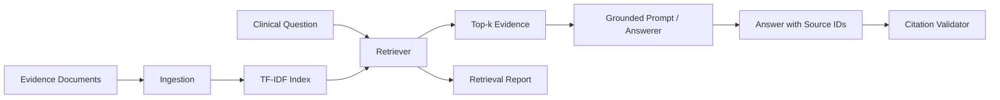

# Dermatology RAG Evidence Assistant

[](https://github.com/hampikamayuq/Dermatology-RAG-Evidence-Assistant-/actions/workflows/ci.yml)

A clinician-oriented retrieval-augmented generation (RAG) portfolio project for evidence-grounded dermatology answers with explicit source citations.

> **Portfolio / research demo only.** The bundled evidence cards are synthetic teaching summaries, not clinical guidelines. This repository does not provide patient-specific medical advice and contains no patient data.

## Why this project exists

A medical RAG system should do more than retrieve similar text. It should make it easy to inspect:

- what evidence was retrieved;
- which claims are linked to which source;
- whether an answer contains unsupported citations;
- whether the model should abstain when retrieval is weak;
- how retrieval and answer-generation can be evaluated separately.

This project implements a small, transparent pipeline that can later be connected to PubMed, guidelines, institutional protocols, or a governed document library.

## Architecture



## Implemented components

- evidence-card ingestion from JSON;
- TF-IDF cosine-similarity retrieval;
- configurable top-k results and minimum retrieval threshold;
- source-aware context assembly;
- deterministic grounded demo answerer;
- citation validation;
- tests for retrieval, abstention and citation integrity;
- GitHub Actions CI.

## Quick start

```bash
python -m venv .venv
source .venv/bin/activate  # Windows: .venv\Scripts\activate
pip install -e .[dev]
derm-rag "When should a changing pigmented lesion be assessed in person?"
pytest
```

The default demo does not call an external LLM. It is intentionally deterministic so that retrieval and citation behavior can be tested independently.

## Example

```text
Question: When should a changing pigmented lesion be assessed in person?

Retrieved:
- SYN-DERM-001 | score=0.41 | Evaluation of changing pigmented lesions
- SYN-DERM-004 | score=0.16 | Limits of remote lesion assessment

Answer:
A changing pigmented lesion warrants clinician assessment when evolution or concerning morphology is present [SYN-DERM-001]. If image quality or lesion context is inadequate, in-person assessment should be considered [SYN-DERM-004].
```

## Repository structure

```text
src/derm_rag/
  models.py
  corpus.py
  retriever.py
  answerer.py
  citations.py
  cli.py

data/
  synthetic_evidence_cards.json

tests/
  test_retrieval.py
  test_citations.py
```

## Safety-oriented design choices

1. Evidence source IDs remain visible in the final answer.
2. The answerer receives only retrieved context, not the full corpus.
3. Retrieval confidence can trigger abstention.
4. Citation IDs are validated against actually retrieved documents.
5. The demo corpus is explicitly synthetic to avoid presenting generated summaries as real evidence.

## Production extensions

- ingest PubMed metadata/abstracts or licensed guideline content;
- semantic embeddings and hybrid BM25/vector retrieval;
- metadata filters for year, evidence type and specialty;
- reranking;
- chunk-level provenance;
- structured answer schemas;
- claim-level citation checking;
- offline retrieval metrics such as Recall@k and MRR;
- answer-level groundedness and completeness evaluation;
- clinician review workflow;
- PHI-safe query handling and audit logging.

## Skills demonstrated

`RAG` · `Healthcare AI` · `Information retrieval` · `Python` · `scikit-learn` · `Citation grounding` · `Clinical safety` · `LLM systems` · `Evaluation`

## Author

**Diego Ivan Galvez Sanchez**  
Physician · Dermatologist · Applied AI & Healthcare

## Related portfolio projects

- [Clinical AI Automation](https://github.com/hampikamayuq/Clinical-AI-Automation)
- [Medical LLM Evaluation Bench](https://github.com/hampikamayuq/Medical-LLM-Evaluation-Bench)
